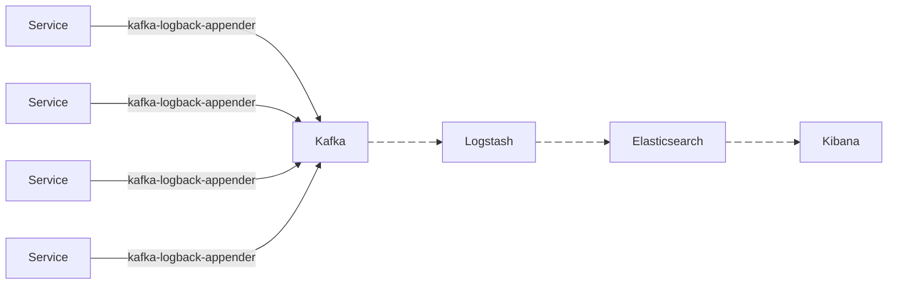

# pos-logging-service
### spring boot -> Kafka ->Logstash -> Elasticsearch -> Kibana


# Architecture





The system architecture (microservices -> Kafka -> Logging Service -> Elasticsearch) would use Logstash as the "logging service" component to consume from Kafka and prepare the data for analysis.
Other services log to Kafka topics.
Logstash instances run as a dedicated service, consuming from these Kafka topics.
Logstash processes and transforms the logs as needed.
Logstash outputs the structured data to Elasticsearch for indexing and searching.
Kibana is used for visualization and analysis.

## Kafka topic strategy
```
<env>.<service>-logs
```
**Examples**
- dev.mail-service-logs
- prod.mail-service-logs
- staging.payment-service-logs


## PORTS
-  **Spring Web Server Port: ``8081``**
-  **Elasticsearch: ``5600``**
-  **Logstash     : ``5601``**
-  **Kibana: ``5602``**